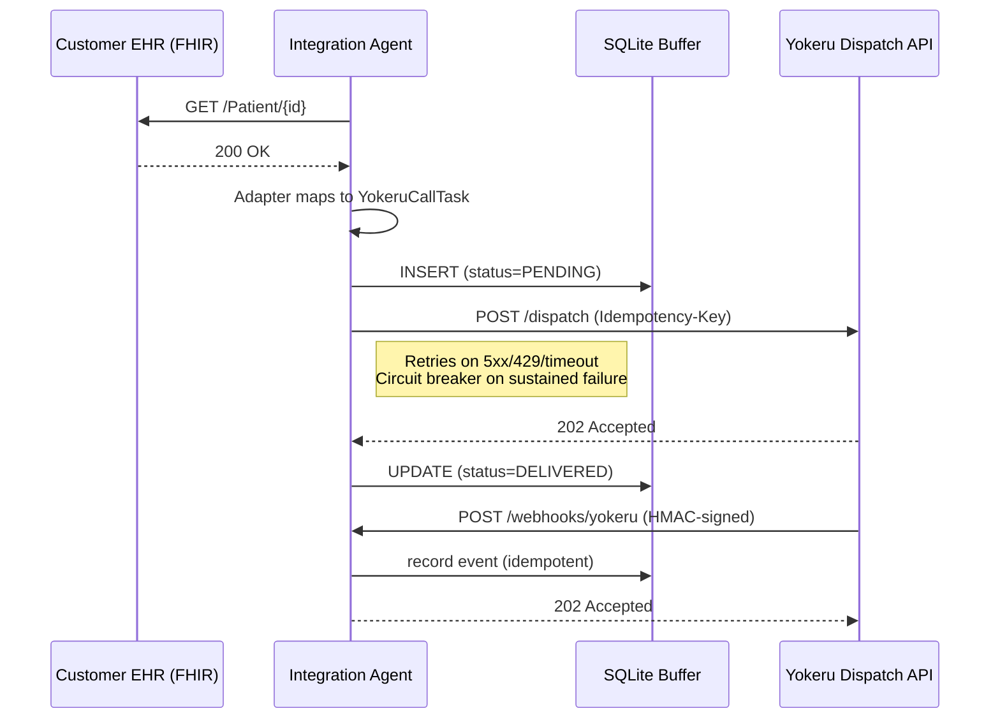
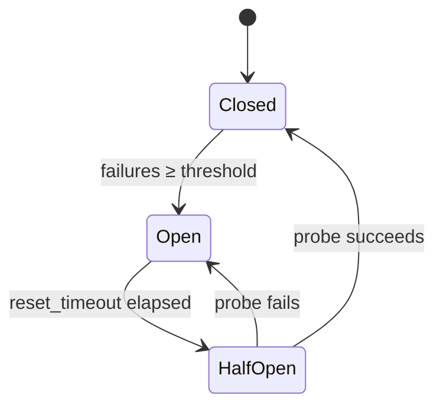

# Yokeru Resilient Integration Agent

> **Disclaimer:** This is an independent portfolio / demo project. It is **not** affiliated with, endorsed by, or connected to [Yokeru](https://www.yokeru.ai) in any way. The Yokeru name and product references are used solely to illustrate a realistic integration scenario against a hypothetical voice-agent API. No proprietary Yokeru code, credentials, or internal documentation was used in its creation.

A production integration agent that connects healthcare EHR systems (FHIR) to the Yokeru voice-agent platform. Designed around the failure modes a real care-team integration sees daily: flaky upstream APIs, partial data, webhook replays, and crash recovery.

## High-Level Overview

**The Problem:** Care teams frequently need to perform routine "welfare checks" by calling patients to ensure they are okay. Doing this manually for hundreds of patients consumes valuable staff time. Automated voice platforms (like Yokeru) can make these calls automatically, but they need to know *who* to call, and the care team needs to know the *outcome* of those calls.

**The Solution:** This software acts as a secure, automated "bridge" between a database (EHR) and an AI voice platform. 

1. **Information Gathering:** It securely reads patient contact information from the database (EHR).
2. **Tasking the AI:** It sends this information to the voice platform, instructing it to make the calls.
3. **Closing the Loop:** After the voice platform finishes a call, it sends the results (e.g., patient answered, no answer, or call failed) back to this bridge, which safely records the outcome for the care team.

**Why does it need to be "Resilient"?**
In the real world, hospital networks go offline, internet connections drop, and servers crash. This software is specifically engineered so that **no patient is ever forgotten or called twice by mistake**. If the system crashes in the middle of its work, it uses a durable local memory to remember exactly where it left off, and safely resumes once everything is back online.

## What it does



## Features

- **Pluggable EHR adapters**, `BaseEHRAdapter` interface; `CernerFHIRAdapter` ships out of the box. New customer systems plug in without touching the agent core.
- **Durable buffering**, every task is written to SQLite (WAL mode) before any outbound call. A crash mid-dispatch leaves a `PENDING` row that the next run replays.
- **Idempotent dispatch**, the per-task `correlation_id` is sent as `Idempotency-Key`, so recovery replays cannot produce a duplicate welfare call.
- **Targeted retries**, `tenacity`-based exponential backoff *only* on transient failures (5xx, 429, timeouts, connection errors). 4xx errors are treated as permanent and don't waste retries.
- **Real circuit breaker**, async state machine (`CLOSED → OPEN → HALF_OPEN`) that fast-fails dispatches once an upstream goes hard-down, so the agent doesn't exhaust its connection pool or pile retries on a sick service.
- **Inbound webhooks**, FastAPI endpoint with HMAC-SHA256 signature verification and event-ID-based deduplication. Terminal events (`call.completed` / `call.failed` / `call.no_answer`) stamp the outcome onto the originating `call_buffer` row, so dispatch and result live in one queryable place.
- **Observability**, structured JSON logs with `correlation_id` propagated end-to-end and best-effort PHI redaction in the formatter; Prometheus `/metrics` exposing attempts, retries, breaker state, and webhook outcomes.
- **Graceful shutdown**, SIGTERM/SIGINT trips a stop event so in-flight work cancels cleanly; the durable buffer means anything not finished replays on the next run.
- **Configurable**, every URL, timeout, and threshold is a `YOKERU_*` environment variable via `pydantic-settings`; see `.env.example`.

## Stack

- **Python 3.12+**, packaged and run with [`uv`](https://github.com/astral-sh/uv).
- **FastAPI** + **uvicorn**, webhook receiver and `/healthz` / `/metrics` endpoints.
- **httpx** (async), outbound calls to FHIR sources and the Yokeru dispatch API.
- **tenacity**, retry policy with exponential backoff, scoped to transient errors only.
- **pydantic** + **pydantic-settings**, payload schemas (`YokeruCallTask`, `WebhookEvent`) and `YOKERU_*` env-var configuration.
- **SQLite** (stdlib `sqlite3`, WAL mode), durable buffer for `call_buffer` + `webhook_events`.
- **prometheus-client**, counters / gauges scraped at `/metrics`.
- **pytest** + **pytest-asyncio** + **respx**, unit and integration tests with mocked HTTP.
- **ruff**, lint + format.
- **Docker** (non-root, `uv sync --frozen`) and **GitHub Actions** for CI.

## Layout

```
src/
├── adapters/        # BaseEHRAdapter + concrete EHR mappers
│   ├── base.py
│   └── cerner_fhir.py
├── agent.py         # Orchestration: fetch → buffer → dispatch → mark
├── breaker.py       # Async circuit breaker
├── db.py            # SQLite buffer (call_buffer + webhook_events)
├── logging_setup.py # JSON / text formatter, correlation-id filter, PHI redactor
├── main.py          # CLI entrypoint (run / replay / serve)
├── metrics.py       # Prometheus counters and gauges
├── schemas.py       # Pydantic models (YokeruCallTask, WebhookEvent)
├── settings.py      # pydantic-settings configuration
└── webhook.py       # FastAPI app: /webhooks/yokeru, /metrics, /healthz
tests/               # adapter, agent (respx-mocked), breaker, db, logging, webhook
```

## Quick start

### Prerequisites
- Python 3.12+
- [`uv`](https://github.com/astral-sh/uv)

### Install

```bash
uv sync
cp .env.example .env  # optional, defaults work against the public Cerner sandbox
```

### Run a single welfare check

```bash
uv run yokeru-agent run 12508044
```

This will:
1. Replay any `PENDING` rows left by a prior crash.
2. Fetch patient `12508044` from the Cerner public FHIR sandbox.
3. Buffer the task locally and POST it to the configured Yokeru endpoint with an `Idempotency-Key`.

Use `--no-replay` to skip step 1.

### Replay pending tasks only

```bash
uv run yokeru-agent replay
```

### Run the webhook server

```bash
uv run yokeru-agent serve --port 8000
# POST /webhooks/yokeru   (HMAC-signed inbound events)
# GET  /metrics           (Prometheus)
# GET  /healthz
```

### End-to-end demo

`demo_e2e.sh` proves the full welfare-check lifecycle in one shot. It requires the webhook server to be running in a separate terminal.

```bash
# Terminal 1, start the webhook server
uv run yokeru-agent serve --port 8000

# Terminal 2, run the e2e demo
./demo_e2e.sh
```

The script walks through five steps:

| Step | What happens |
|---|---|
| **1** | Dispatches a welfare check for patient `12508044` from the Cerner FHIR sandbox. |
| **2** | Queries `call_buffer`, row shows `status=DELIVERED`, `outcome=NULL`. |
| **3** | Simulates Yokeru calling back with a signed `call.completed` webhook. |
| **4** | Queries the same row, `outcome=completed` and `completed_at` are now stamped. |
| **5** | Shows the raw event stored in `webhook_events` for audit. |

Two additional scripts are available for testing individual pieces:

- **`demo_agent.sh`**, dispatches a welfare check and dumps the `call_buffer` table.
- **`demo_webhook.sh`**, hits `/healthz`, `/metrics`, and `/webhooks/yokeru` (valid + invalid signature).

## Database schema

```
call_buffer
├── correlation_id   TEXT PK , UUID + Idempotency-Key
├── patient_id       TEXT
├── payload          TEXT    , JSON-serialized YokeruCallTask
├── status           TEXT    , PENDING | DELIVERED | FAILED_PERMANENT
├── synced           INTEGER , 0 until terminal state
├── attempts         INTEGER
├── reason           TEXT    , populated on FAILED_PERMANENT for triage
├── outcome          TEXT    , completed | failed | no_answer (set by webhook)
├── completed_at     TEXT    , when the terminal webhook arrived
├── created_at       TEXT
└── updated_at       TEXT

webhook_events
├── event_id     TEXT PK , provider-supplied; PK enforces idempotency
├── event_type   TEXT
├── received_at  TEXT
└── payload      TEXT
```

The webhook handler closes the loop: a `call.completed` / `call.failed` /
`call.no_answer` event keyed by `correlation_id` stamps `outcome` and
`completed_at` onto the originating `call_buffer` row, so a single SQL query
gives both dispatch and outcome state.

Inspect locally with `make inspect`.

## Circuit breaker



When `OPEN`, dispatches raise `BreakerOpenError` immediately and the task is left `PENDING` for the next run rather than burning retries on a known-bad upstream.

## Error classification

| Class | Examples | Behavior |
|---|---|---|
| Permanent (data) | Patient has no phone, EHR returns 404 | Marked `FAILED_PERMANENT`, no retry |
| Permanent (request) | Yokeru API returns 4xx (not 429) | Marked `FAILED_PERMANENT`, no retry |
| Transient | 5xx, 429, timeout, connect error | Retried with exponential backoff; if still failing, left `PENDING` |
| Breaker open | Sustained transient failures | Fast-fail; left `PENDING` |

## Failure modes

What actually happens when things go wrong.

### Upstream EHR (FHIR) is down

| Failure | What the agent does |
|---|---|
| **Connection refused / DNS failure** | `httpx.ConnectError` propagated; logged as a transient EHR failure. Task is never buffered because there is no data to buffer. `yokeru_calls_failed_total{kind="transient"}` incremented. The next `run` or `replay` retries the same patient. |
| **5xx / 429 from FHIR** | Same as above, logged as transient, no buffer row created. |
| **4xx (not 429) from FHIR** | Treated as permanent (e.g., patient deleted, invalid ID). Logged as a permanent skip; no buffer row. |
| **Slow / hanging FHIR** | `YOKERU_HTTP_READ_TIMEOUT_S` (default 10 s) fires a `ReadTimeout`. Treated identically to connection refused. |

**Key point:** because the fetch happens *before* the buffer write, a FHIR outage produces zero orphan rows. There is nothing to clean up.

### Yokeru dispatch API is down

| Failure | What the agent does |
|---|---|
| **5xx / 429 / timeout / connect error** | Retried with exponential backoff up to `YOKERU_RETRY_MAX_ATTEMPTS` (default 3). If all retries fail, the task stays `status=PENDING, synced=0` in `call_buffer`. The next `uv run yokeru-agent replay` (or a `run` without `--no-replay`) re-dispatches it with the same `Idempotency-Key`, so recovery cannot duplicate a real welfare call. |
| **4xx (not 429)** | Classified as permanent, the task is marked `FAILED_PERMANENT` with the HTTP status in the `reason` column. No retry. |
| **Sustained outage (≥ threshold consecutive failures)** | Circuit breaker flips to `OPEN`. Subsequent dispatches in the same process are fast-failed (`BreakerOpenError`) without touching the network, leaving tasks `PENDING`. After `YOKERU_BREAKER_RESET_TIMEOUT_S` elapses, the breaker moves to `HALF_OPEN` and allows one probe request through. |

### SQLite / disk issues

| Failure | What the agent does |
|---|---|
| **DB file locked (another process)** | `sqlite3.OperationalError` with "database is locked." The agent crashes with a stack trace. On restart, WAL journaling ensures no data corruption. Any `PENDING` rows from the previous run survive and replay. |
| **Disk full** | The `INSERT` into `call_buffer` fails. Because this happens *before* the outbound POST, no call is dispatched without a durable record. The agent exits; operator must free disk. |
| **DB file deleted mid-run** | `_init()` recreates the schema on next instantiation. Previously buffered rows are lost, but no duplicate calls are possible because the Yokeru API deduplicates on `Idempotency-Key` and the `correlation_id` that was lost can never be reissued. |

### Agent process crash

| Failure | What the agent does |
|---|---|
| **Kill -9 / OOM mid-fetch** | No buffer row exists yet. Nothing to recover. The patient simply isn't processed until the next run. |
| **Kill -9 / OOM after buffer, before POST** | Row is `PENDING, synced=0`. Next `replay` picks it up and dispatches. |
| **Kill -9 / OOM after POST, before `mark_delivered`** | Row is still `PENDING`. Replay re-sends with the same `Idempotency-Key`, so Yokeru deduplicates and the call is not placed twice. |
| **SIGTERM / SIGINT (graceful)** | The agent cancels in-flight work via `asyncio.Event`, logs `Shutdown signal received`, and exits. Same recovery path as above. |

### Webhook edge cases

| Failure | What the agent does |
|---|---|
| **Webhook arrives for unknown `correlation_id`** | Event is stored in `webhook_events` (for audit), but no `call_buffer` row is updated. A warning is logged. Response is still `202 Accepted`, the upstream is not at fault. |
| **Duplicate webhook (same `event_id`)** | `webhook_events.event_id` PRIMARY KEY rejects the insert. Response is `{"status":"duplicate"}`. The `call_buffer` row is not re-stamped. |
| **Invalid HMAC signature** | Rejected with `401 Unauthorized`. `yokeru_webhooks_received_total{kind="invalid_signature"}` incremented. |
| **Malformed JSON / schema mismatch** | Rejected with `400 Bad Request`. The upstream should not retry, the payload itself is broken. |
| **Webhook server not running** | Events accumulate on the Yokeru side. When the server comes back up, Yokeru's standard retry loop replays them. The `event_id` PK ensures idempotent processing regardless of how many times the same event is delivered. |

## Observability

All logs are structured JSON by default with the originating `correlation_id`:

```json
{"timestamp":"2026-05-07T12:00:00Z","level":"INFO","logger":"src.agent","correlation_id":"a1b2c3","message":"Task buffered to local SQLite"}
```

For local development:

```bash
YOKERU_LOG_FORMAT=text YOKERU_LOG_LEVEL=DEBUG uv run yokeru-agent run 12508044
```

Prometheus metrics exposed by the webhook server:

| Metric | Type | Labels |
|---|---|---|
| `yokeru_calls_attempted_total` | counter | `adapter` |
| `yokeru_calls_delivered_total` | counter | `adapter` |
| `yokeru_calls_failed_total` | counter | `adapter`, `kind` (permanent/transient) |
| `yokeru_http_retries_total` | counter | `target` |
| `yokeru_webhooks_received_total` | counter | `kind` (new/duplicate/invalid_signature) |
| `yokeru_breaker_state` | gauge | `name` (0=closed, 1=half_open, 2=open) |

## Inbound webhook

Yokeru's voice-agent platform is the source of truth for what happened on the call. The agent runs a webhook receiver so that outcome (`completed` / `failed` / `no_answer`) flows back into the same `call_buffer` row that triggered the dispatch, closing the loop between *we asked for a welfare call* and *here is what happened*.

### Endpoint

```
POST /webhooks/yokeru
Content-Type: application/json
X-Yokeru-Signature: sha256=<hex>
```

Run the receiver with `uv run yokeru-agent serve` (or via Docker, `serve` is the default `CMD`). It also exposes `GET /healthz` (liveness) and `GET /metrics` (Prometheus).

### Payload

```json
{
  "event_id": "evt_2x9f8a…",
  "event_type": "call.completed",
  "correlation_id": "a1b2c3d4-…",
  "occurred_at": "2026-05-07T12:34:56Z",
  "detail": { "duration_s": 42 }
}
```

| Field | Type | Notes |
|---|---|---|
| `event_id` | string | Unique per event. Used as the dedup key, replays of the same `event_id` return `{"status":"duplicate"}` and do not re-stamp the row. |
| `event_type` | enum | One of `call.completed`, `call.failed`, `call.no_answer`. Adding new event types requires a code change (see `EVENT_TYPE_TO_OUTCOME` in `src/db.py`). |
| `correlation_id` | string | The same id the agent sent on the original dispatch as `Idempotency-Key` and `X-Correlation-Id`. This is how the receiver finds the originating row. |
| `occurred_at` | RFC3339 timestamp | When the event happened on Yokeru's side. |
| `detail` | object | Free-form per-event metadata (call duration, failure reason, …). Stored verbatim in `webhook_events.payload`; treat as PHI-adjacent. |

### Signature

Compute `HMAC-SHA256(YOKERU_WEBHOOK_SIGNING_SECRET, raw_request_body)` and send it as `X-Yokeru-Signature: sha256=<lowercase-hex>`. The receiver uses constant-time comparison.

Reference (Python):

```python
import hmac, hashlib
sig = "sha256=" + hmac.new(secret.encode(), body, hashlib.sha256).hexdigest()
```

The signature must be computed over the **raw bytes** of the request body, before any JSON re-serialisation. Reformatting the JSON between signing and sending will invalidate the signature.

### Responses

| Status | Body | Meaning |
|---|---|---|
| `202 Accepted` | `{"status":"accepted","event_id":…,"outcome":…}` | New event; outcome stamped on `call_buffer` row. |
| `202 Accepted` | `{"status":"duplicate","event_id":…}` | `event_id` already seen; safe to retry. |
| `202 Accepted` | `{"status":"accepted","event_id":…,"outcome":…}` + warning log | Event was new but `correlation_id` matches no buffered call (orphan); we log and accept rather than 4xx, because the upstream isn't at fault. |
| `400 Bad Request` | `{"detail":"invalid payload"}` | JSON failed schema validation. Yokeru should *not* retry, the payload is malformed. |
| `401 Unauthorized` | `{"detail":"invalid signature"}` | HMAC mismatch (or header missing). Yokeru should rotate / re-check the signing secret rather than retry blindly. |

The receiver always returns `202` for retryable success outcomes (including duplicates), so Yokeru's standard "retry until 2xx" delivery loop is safe to use without producing double-stamps.

### What happens on receipt

1. Verify HMAC signature (constant-time). On mismatch → 401, increment `yokeru_webhooks_received_total{kind="invalid_signature"}`.
2. Validate against the `WebhookEvent` Pydantic schema. On failure → 400.
3. `INSERT` into `webhook_events`. The `event_id` PRIMARY KEY enforces dedup at the DB layer; a duplicate raises `IntegrityError`, which short-circuits to a `{"status":"duplicate"}` response.
4. Map `event_type` → `outcome` and `UPDATE call_buffer SET outcome=?, completed_at=now WHERE correlation_id=?`. If no row matches, log a warning (orphan) but still 202.
5. Increment `yokeru_webhooks_received_total{kind="new"|"duplicate"}`.

### Operating it behind TLS

The bundled FastAPI app does not terminate TLS. Put it behind a reverse proxy (nginx, Caddy, a cloud load balancer) and forward `https://…/webhooks/yokeru` → `http://agent:8000/webhooks/yokeru`. Keep the signing secret in a secret manager and rotate it by deploying both old + new secrets briefly, then dropping the old.

## Data handling and PHI

The agent handles patient-identifying data (phone numbers, language preferences) and is intended to run inside the customer's trust boundary. The protections in this repo:

- **Logs**: the JSON and text formatters route all messages through a phone-number redactor (`redact_phi` in `logging_setup.py`) so accidental `f"...{phone}..."` log calls don't ship raw PHI.
- **DB at rest**: `call_buffer.payload` and `webhook_events.payload` are stored as plaintext JSON. This is acceptable only when the SQLite file lives on an encrypted volume (LUKS / BitLocker / equivalent on the customer host). For deployments without disk-level encryption, swap in `sqlcipher` (drop-in API-compatible) and provide the key via `YOKERU_DB_KEY`.
- **Transport**: outbound calls use HTTPS; the webhook server should be fronted by TLS termination (the bundled FastAPI app does not terminate TLS itself).
- **Secrets**: `YOKERU_WEBHOOK_SIGNING_SECRET` ships with a deliberately bad default (`dev-secret-change-me`) so misconfiguration is loud during smoke tests. Production deploys must override it; the recommended pattern is a 32+ byte random value from a secret manager.

PHI redaction is best-effort pattern matching, it is not a substitute for not logging the field in the first place. Treat it as a backstop, not a license.

## Testing

```bash
make test       # unit + integration (respx-mocked HTTP)
make lint
```

35 tests across 6 files cover: adapter FHIR-to-canonical mapping, transient-then-success retry, 4xx permanent classification, persistent-failure pending state, recovery replay with idempotency-key reuse, breaker state transitions (`CLOSED`/`OPEN`/`HALF_OPEN`), EHR network errors (`ConnectError`, `ReadTimeout`) being classified as transient instead of crashing the CLI, webhook signature accept/reject paths, idempotent webhook replay, webhook → `call_buffer` outcome wiring (parametrised across all three event types), orphan-webhook handling, permanent-failure `reason` persistence, and PHI redaction (with a regression test that UUIDs / hashes are *not* mangled).

## Docker

```bash
make docker
docker run --rm -p 8000:8000 -e YOKERU_WEBHOOK_SIGNING_SECRET=... yokeru-integration
```

Image runs as a non-root user, has a `/healthz` healthcheck, and uses `uv` with frozen dependencies.

## Why these choices

- **SQLite, not Postgres.** Customers run on locked-down on-prem hardware; a single-file embedded DB is one less thing to operationalize and is more than enough throughput for buffering. WAL mode makes it crash-safe.
- **Idempotency keys, not "exactly-once."** True exactly-once doesn't exist over the network. Sending `Idempotency-Key = correlation_id` on every retry/replay shifts dedup responsibility to the receiver, which is the only place it can actually be solved.
- **Breaker AND retries.** Backoff handles a hiccup; the breaker handles a hard outage. Without a breaker, retries pile up against a dead upstream and cost the agent its connection pool.
- **Adapters per EHR.** Customer systems disagree on field shapes. A thin adapter layer keeps that mess out of the orchestration code, so onboarding a new EHR is a 50-line file, not a refactor.

## Known limitations

The shape is right, but a few items are explicitly out of scope for the current cut and worth flagging before the next iteration:

- **Replay is serial.** `replay_pending` walks `PENDING` rows one at a time and `await`s each dispatch. That is fine at the per-customer call volumes we currently target (single-digit thousands per run), but the README's framing of "thousands of calls in minutes" assumes concurrent dispatch. The straight-line fix is an `asyncio.Semaphore`-bounded `gather` over the row list, plus a `LIMIT/OFFSET` so a large backlog doesn't materialise as one giant Python list. No schema change required.
- **`list_unsynced` → dispatch is not atomic.** The current single-process CLI reads all `PENDING` rows then dispatches them; nothing prevents a second invocation (or a future worker pool) from picking up the same row. Today's deployment model is one agent per customer host, so this is theoretical, but adding a `claimed_at` / `claimed_by` column and an `UPDATE … WHERE status='PENDING' AND claimed_at IS NULL RETURNING …` claim step is the right shape before running multiple workers concurrently against the same SQLite file.

## License

MIT, see `LICENSE`.
